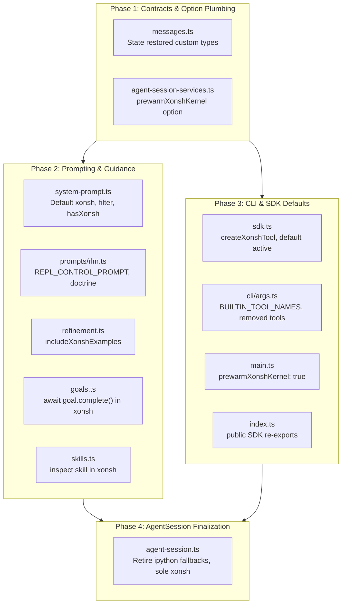

# Migration Plan: Replacing IPython with Xonsh in Agent Core & CLI

> Implementation and migration plan to completely replace `ipython` with `xonsh` as the primary REPL tool in Agent Core, Session Services, Prompting, and CLI / Public Entrypoints.

---

## Executive Summary

Prime Agent has introduced `xonsh` as a persistent REPL tool (`packages/coding-agent/src/core/tools/xonsh.ts`). Currently, `agent-session.ts` is in the process of supporting `xonsh` alongside `ipython`. However, `ipython` remains hardcoded as the default built-in tool in the CLI, session orchestration, prompt templates, continual harness guidance, SDK factory defaults, and public module exports.

This plan details the exact files, symbols, line numbers, and changes required across:
1. **CLI & Public Entrypoints** (`src/cli/`, `src/index.ts`, `src/main.ts`)
2. **Agent Core & Session** (`packages/coding-agent/src/core/`)

---

## Scope & Boundaries

- **In Scope**:
  - `packages/coding-agent/src/cli/args.ts`
  - `packages/coding-agent/src/main.ts`
  - `packages/coding-agent/src/index.ts`
  - `packages/coding-agent/src/core/agent-session-services.ts`
  - `packages/coding-agent/src/core/agent-session.ts` *(noting ongoing updates, identifying remaining touchpoints)*
  - `packages/coding-agent/src/core/sdk.ts`
  - `packages/coding-agent/src/core/system-prompt.ts`
  - `packages/coding-agent/src/core/prompts/rlm.ts`
  - `packages/coding-agent/src/core/refinement/refinement.ts`
  - `packages/coding-agent/src/core/goals.ts`
  - `packages/coding-agent/src/core/skills.ts`
  - `packages/coding-agent/src/core/messages.ts`
  - `packages/coding-agent/src/core/export-html/vendor/highlight.min.js` *(external vendor evaluation)*
- **Out of Scope**:
  - Tool implementation internals (`packages/coding-agent/src/core/tools/`)
  - Extension event system internals (`packages/coding-agent/src/core/extensions/`)
  - Modes and Interactive TUI components (`packages/coding-agent/src/modes/`)
  - Test suites (`packages/coding-agent/test/`) — covered under a subsequent testing plan

---

## Category 1: CLI & Public Entrypoints

### 1. [`packages/coding-agent/src/cli/args.ts`](file:///home/jeff/code/fork/prime-agent/packages/coding-agent/src/cli/args.ts)

#### Code Parts to Read
- **Lines 63–65**:
  ```typescript
  const REMOVED_BUILTIN_TOOL_NAMES = new Set(["read", "write", "grep", "find", "ls"]);
  const BUILTIN_TOOL_NAMES = ["ipython"];
  ```
- **Lines 156–168**: CLI argument parsing for `--tools` and `-t`:
  ```typescript
  } else if ((arg === "--tools" || arg === "-t") && i + 1 < args.length) {
      result.tools = args[++i]
          .split(",")
          .map((name) => name.trim())
          .filter((name) => name.length > 0);
      const removedTools = result.tools.filter((name) => REMOVED_BUILTIN_TOOL_NAMES.has(name));
      if (removedTools.length > 0) {
          result.diagnostics.push({
              type: "error",
              message: `Unknown built-in tool(s): ${removedTools.join(", ")}. Available built-in tools: ${BUILTIN_TOOL_NAMES.join(", ")}`,
          });
      }
  }
  ```

#### Code Parts to Modify
- **Change `BUILTIN_TOOL_NAMES`**: Replace `["ipython"]` with `["xonsh"]`.
- **Update `REMOVED_BUILTIN_TOOL_NAMES`**: Add `"ipython"` to the set of removed tools:
  ```typescript
  const REMOVED_BUILTIN_TOOL_NAMES = new Set(["read", "write", "grep", "find", "ls", "ipython"]);
  const BUILTIN_TOOL_NAMES = ["xonsh"];
  ```
- **Rationale**: Any user or script invoking `prime-agent --tools ipython` will immediately receive a helpful diagnostic: `Unknown built-in tool(s): ipython. Available built-in tools: xonsh`, while `--tools xonsh` becomes valid.

---

### 2. [`packages/coding-agent/src/main.ts`](file:///home/jeff/code/fork/prime-agent/packages/coding-agent/src/main.ts)

#### Code Parts to Read
- **Lines 781–798**: Session creation inside CLI initialization:
  ```typescript
  const created = await createAgentSessionFromServices({
      services,
      sessionManager,
      sessionStartEvent,
      ...resolvedSessionOptions,
      // Main agents boot their kernel in the background at session creation;
      // subagent sessions (rlmDepth > 0) keep the lazy first-call start.
      prewarmIpythonKernel: true,
      ...
  });
  ```

#### Code Parts to Modify
- **Line 788**: Replace `prewarmIpythonKernel: true` with `prewarmXonshKernel: true` (or pass `prewarmXonshKernel: true` alongside for transition):
  ```typescript
  // Main agents boot their kernel in the background at session creation;
  // subagent sessions (rlmDepth > 0) keep the lazy first-call start.
  prewarmXonshKernel: true,
  ```
- **Rationale**: `main.ts` is the CLI entrypoint for running the agent in interactive and non-interactive modes. Prewarming must warm the Xonsh kernel, not the IPython kernel.

---

### 3. [`packages/coding-agent/src/index.ts`](file:///home/jeff/code/fork/prime-agent/packages/coding-agent/src/index.ts)

#### Code Parts to Read
- **Line 89**: `IpythonToolCallEvent,` (re-exported from `./core/extensions/index.js`)
- **Line 136**: `isIpythonToolResult,` (re-exported from `./core/extensions/index.js`)
- **Line 186**: `createIpythonTool,` (re-exported from `./core/sdk.js`)
- **Line 255**: `createIpythonToolDefinition,` (re-exported from `./core/tools/index.js`)
- **Lines 264–267**:
  ```typescript
  IpythonKernelProvisioner,
  type IpythonToolDetails,
  type IpythonToolInput,
  type IpythonToolOptions,
  ```

#### Code Parts to Modify
- **Re-export Xonsh APIs**:
  - Export `createXonshTool` from `./core/sdk.js` (replacing `createIpythonTool`).
  - Export `createXonshToolDefinition`, `XonshKernelProvisioner`, `type XonshToolDetails`, `type XonshToolInput`, `type XonshToolOptions` from `./core/tools/index.js`.
  - Export `XonshToolCallEvent`, `isXonshToolResult` from `./core/extensions/index.js`.
- **Deprecation / Compatibility Policy**:
  - Deprecate or remove `createIpythonTool`, `createIpythonToolDefinition`, `IpythonKernelProvisioner`, etc. If retaining temporary aliases for external consumers, alias `createIpythonTool = createXonshTool`.
- **Rationale**: Consumers of `@earendil-works/prime-agent` using the top-level SDK need access to the Xonsh tool constructors, provisioner, and event types.

---

## Category 2: Agent Core & Session

### 1. [`packages/coding-agent/src/core/agent-session.ts`](file:///home/jeff/code/fork/prime-agent/packages/coding-agent/src/core/agent-session.ts)
*(Note: Already being updated to support Xonsh; focus is on remaining touchpoints to complete the replacement)*

#### Code Parts to Read
- **Imports & Types (lines 304–306, 352, 486–487)**:
  - `IpythonKernelProvisioner` vs `XonshKernelProvisioner`
  - `AgentSessionConfig.prewarmIpythonKernel` vs `AgentSessionConfig.prewarmXonshKernel`
- **Late sent agent messages (lines 789–805, 1191, 1664–1708)**:
  - `IPYTHON_SENT_AGENT_MESSAGE_CUSTOM_ENTRY = "ipython_sent_agent_message"`
  - `_lateIpythonSentAgentMessages`, `_recordLateIpythonSentAgentMessage`, `_applyLateIpythonSentAgentMessages`
- **Primary REPL selection (lines 1434–1469)**:
  - `_getReplProvisioner(activeNames?: string[])`
  - `_primaryReplProvisioner`
- **Goal tool activation (lines 2194–2234)**:
  - `_ensureGoalToolsActive`: currently checks `"xonsh"` then falls back to `"ipython"`.
- **Kernel snapshot & restore (lines 7504–7547)**:
  - State tags: `<ipython_state>`, `</ipython_state>`, custom type `"ipython_state"`
  - Restoration tags: `<ipython_state_restored>`, `</ipython_state_restored>`, `IPYTHON_STATE_RESTORED_CUSTOM_TYPE`
- **Runtime building & default active tool (lines 9343–9510)**:
  - Line 9414: `const defaultActiveToolNames = this._baseToolsOverride ? Object.keys(this._baseToolsOverride) : ["ipython"];`
  - Line 9418: `baseActiveToolNames.push("ipython");` for active goals
  - Lines 9501–9505: Kernel prewarm triggers for `ipython` vs `xonsh`

#### Code Parts to Modify
- **Make Xonsh the sole default tool**:
  - Change default active tool names in `_buildRlmRuntime` from `["ipython"]` to `["xonsh"]`.
  - For active goals, push `"xonsh"` instead of `"ipython"` to `baseActiveToolNames`.
- **Retire IPython Provisioner**:
  - Remove `this._ipythonKernelProvisioner` once all callsites are unified on `this._xonshKernelProvisioner`.
- **Update Transcript Custom Entries**:
  - Update custom entries to use `"xonsh_state"`, `<xonsh_state>`, `<xonsh_state_restored>`, and `XONSH_STATE_RESTORED_CUSTOM_TYPE` (while allowing reading of legacy `"ipython_state_restored"` on session resume).
  - Update late message entry to `xonsh_sent_agent_message` (with backward compatibility for `ipython_sent_agent_message`).

---

### 2. [`packages/coding-agent/src/core/agent-session-services.ts`](file:///home/jeff/code/fork/prime-agent/packages/coding-agent/src/core/agent-session-services.ts)

#### Code Parts to Read
- **Line 70**: `prewarmIpythonKernel?: boolean;` in `AgentSessionCreationOptions` interface.
- **Line 266**: `prewarmIpythonKernel: options.prewarmIpythonKernel,` in `createAgentSessionFromServices`.

#### Code Parts to Modify
- **Line 70**: Add `prewarmXonshKernel?: boolean;` to `AgentSessionCreationOptions` (and deprecate/remove `prewarmIpythonKernel`).
- **Line 266**: Pass `prewarmXonshKernel: options.prewarmXonshKernel` to `createAgentSession`.
- **Rationale**: Without this change, options passed from `main.ts` cannot reach `AgentSession`.

---

### 3. [`packages/coding-agent/src/core/sdk.ts`](file:///home/jeff/code/fork/prime-agent/packages/coding-agent/src/core/sdk.ts)

#### Code Parts to Read
- **Line 21**: Import of `createIpythonTool` from `./tools/index.js`.
- **Lines 45, 52**: JSDoc comments explaining default tool behavior:
  - Line 45: `- "builtin": disable the default built-in tool (ipython)`
  - Line 52: `When omitted, pi enables the default built-in tool (ipython)`
- **Line 104**: `export { createBashTool, createEditTool, createIpythonTool, withFileMutationQueue };`
- **Line 139**: JSDoc example code: `tools: ["ipython"],`
- **Lines 235–239**: Initial active tool resolution:
  ```typescript
  const initialActiveToolNames: string[] =
      options.initialActiveToolNames ?? (options.tools ? [...options.tools] : options.noTools ? [] : ["ipython"]);
  ```
- **Line 374**: Passing prewarm flag: `prewarmIpythonKernel: options.prewarmIpythonKernel,`

#### Code Parts to Modify
- **Line 21 & 104**: Replace `createIpythonTool` with `createXonshTool` in imports and exports.
- **Lines 45, 52, 139**: Update JSDoc documentation to specify `xonsh` as the default built-in tool.
- **Line 238**: Change default active tool fallback from `["ipython"]` to `["xonsh"]`.
- **Line 374**: Change `prewarmIpythonKernel: options.prewarmIpythonKernel` to `prewarmXonshKernel: options.prewarmXonshKernel`.
- **Update `CreateAgentSessionOptions` interface**: Include `prewarmXonshKernel?: boolean`.

---

### 4. [`packages/coding-agent/src/core/system-prompt.ts`](file:///home/jeff/code/fork/prime-agent/packages/coding-agent/src/core/system-prompt.ts)

#### Code Parts to Read
- **Lines 67–74**:
  ```typescript
  const tools = selectedTools ?? ["ipython"];
  const hasIpython = tools.includes("ipython");
  const hasBash = tools.includes("bash");
  const visibleSkills = skills.filter((skill) => !skill.disableModelInvocation);
  const visiblePythonSkillImportNames = getPythonSkillRuntimeInfo(visibleSkills).map((skill) => skill.importName);
  const hasRefineSkill = visibleSkills.some((skill) => skill.name === REFINE_SKILL_NAME);
  const genericMcpSection = hasIpython ? formatGenericMcpGuidance(options.genericMcpServers) : "";
  ```
- **Lines 88–92**:
  ```typescript
  const customPromptHasFileAccess =
      !selectedTools || selectedTools.includes("ipython") || selectedTools.includes("bash");
  ```
- **Lines 108–110 & 147–149**:
  ```typescript
  if (harnessState) {
      prompt += `\n\n${formatHarnessStateForPrompt(harnessState, { includeIpythonExamples: hasIpython, includeShellExamples: hasBash, includeRefineExamples: hasIpython && hasRefineSkill })}`;
  }
  ```
- **Lines 123–131**:
  ```typescript
  let prompt = buildRlmPrompt({
      cwd: promptCwd,
      messagesPath: promptMessagesPath,
      installedSkills: visiblePythonSkillImportNames,
      activeTools: tools.filter((name) => name === "ipython" || name === "bash" || name === "edit"),
      allowRecursion,
      depth: options.rlmDepth,
      parentAgent: options.rlmParentAgent,
  });
  ```
- **Lines 136–145**:
  ```typescript
  if ((allowRecursion ?? true) && hasIpython) {
      const visiblePythonSkillNames = new Set(
          getPythonSkillRuntimeInfo(visibleSkills).map((skill) => skill.importName),
      );
      prompt += `\n\n${buildSubagentGuidance({
          includeRefineExamples: hasRefineSkill,
          hasAgentMessage: visiblePythonSkillNames.has("agent_message"),
          hasAgentObserve: visiblePythonSkillNames.has("agent_observe"),
      })}`;
  }
  ```
- **Lines 170–173**:
  ```typescript
  const hasFileAccess = tools.includes("ipython") || tools.includes("bash");
  ```

#### Code Parts to Modify
- **Line 67**: Change default `selectedTools ?? ["ipython"]` to `selectedTools ?? ["xonsh"]`.
- **Line 68**: Replace `const hasIpython = tools.includes("ipython")` with `const hasXonsh = tools.includes("xonsh")`.
- **Line 73**: Replace `hasIpython` with `hasXonsh` for `genericMcpSection`.
- **Line 89**: Replace `selectedTools.includes("ipython")` with `selectedTools.includes("xonsh")`.
- **Lines 109, 148**: Update option passed to `formatHarnessStateForPrompt`: pass `{ includeXonshExamples: hasXonsh, ... }`.
- **Line 127**: Include `"xonsh"` in the active tools filter:
  `tools.filter((name) => name === "xonsh" || name === "bash" || name === "edit")`.
- **Line 136**: Check `hasXonsh` instead of `hasIpython` before appending `buildSubagentGuidance`.
- **Line 170**: Replace `tools.includes("ipython")` with `tools.includes("xonsh")` for `hasFileAccess`.
- **Critical Risk if Omitted**: If `system-prompt.ts` is not modified, passing `xonsh` filters out all active tools from `buildRlmPrompt`, causing the agent to lose its REPL control guidance, subagent doctrine, and skills instructions.

---

### 5. [`packages/coding-agent/src/core/prompts/rlm.ts`](file:///home/jeff/code/fork/prime-agent/packages/coding-agent/src/core/prompts/rlm.ts)

#### Code Parts to Read
- **Lines 30–52 (`REPL_CONTROL_PROMPT`)**:
  - Line 31:
    `"The \`ipython\` tool is a persistent Python REPL — the agent's long-lived control environment for reasoning, context management, state, tool orchestration, and recursive subcalls. Top-level \`await\` works directly..."`
  - Lines 33–51: Guidance on Python as orchestration language, using `bash()`, persistence, and state.
- **Lines 61–76 (`buildChildAgentDoctrine`)**:
  - Line 63: `const hasIpython = options.activeTools === undefined || options.activeTools.includes("ipython");`
  - Line 70: `if (hasAgentMessage && hasIpython)`
- **Lines 78–194 (`buildRlmPrompt`)**:
  - Line 86: `const hasIpython = options.activeTools === undefined ? true : activeTools.includes("ipython");`
  - Line 87: `const canRunShellSkills = hasIpython || activeTools.includes("bash");`
  - Line 116: `if (hasIpython)` - outputs `"Installed Python skill modules (pre-imported): ..."`
  - Line 129: `if (hasIpython && installedSkills.includes("edit"))` - outputs edit skill usage
  - Line 149: `if (depth === 0 && hasIpython)` - outputs daemon session creation
  - Line 156: `if (allowRecursion && hasIpython)` - outputs `rlm(...)` recursion guidance
  - Line 183: `if (hasIpython)` - appends `REPL_CONTROL_PROMPT`

#### Code Parts to Modify
- **Update `REPL_CONTROL_PROMPT`**:
  - Reframe description around the `xonsh` tool:
    `"The \`xonsh\` tool is a persistent Xonsh REPL — the agent's long-lived control environment for reasoning, context management, state, tool orchestration, and recursive subcalls. Top-level \`await\` works directly. Execute Python and shell code seamlessly..."`
  - Emphasize Xonsh idioms: running shell commands directly or with `bash('cmd')` / `await bash('cmd')`, variable and state persistence.
- **Update Tool Checks (`hasIpython` -> `hasXonsh`)**:
  - In `buildChildAgentDoctrine`: change check to `options.activeTools.includes("xonsh")`.
  - In `buildRlmPrompt`: change line 86 to `const hasXonsh = options.activeTools === undefined ? true : activeTools.includes("xonsh");`.
  - Update lines 87, 116, 129, 149, 156, and 183 to check `hasXonsh`.
- **Update Skill Instructions**:
  - Skill modules remain importable and callable in Xonsh (via Python semantics), while also callable directly as commands. Maintain documentation of `await <skill>.<func>()`.

---

### 6. [`packages/coding-agent/src/core/refinement/refinement.ts`](file:///home/jeff/code/fork/prime-agent/packages/coding-agent/src/core/refinement/refinement.ts)

#### Code Parts to Read
- **Lines 415–430**:
  - Option `includeIpythonExamples?: boolean;`
  - Default: `const includeIpythonExamples = options.includeIpythonExamples ?? true;`
- **Lines 443–448**:
  - Text:
    ```typescript
    includeIpythonExamples
        ? "Call contract: read each installed Python skill's SKILL.md and call its documented module function in the Python REPL..."
        : options.includeShellExamples
            ? "Call contract: use installed skills as shell commands when available (for example `<skill_import> ...`). Continual harness entries are routing/context hints only in sessions without the Python REPL..."
            : "Call contract: continual harness entries are routing/context hints only in sessions without the Python REPL or shell access..."
    ```
- **Line 460**:
  `if (kind === "subagent" && entries.length > 0 && includeIpythonExamples)`

#### Code Parts to Modify
- **Option Renaming**:
  - Rename `includeIpythonExamples?: boolean` to `includeXonshExamples?: boolean` (supporting `includeIpythonExamples` as a legacy fallback).
- **Update Guidance Strings**:
  - Replace references to "Python REPL" with "Xonsh REPL" in call contract descriptions.
- **Line 460**: Update check to `includeXonshExamples`.

---

### 7. [`packages/coding-agent/src/core/goals.ts`](file:///home/jeff/code/fork/prime-agent/packages/coding-agent/src/core/goals.ts)

#### Code Parts to Read
- **Line 40**: Documentation comment: `/** Reply payload for goal.* host requests from the Python kernel. */`
- **Lines 225–230 (`formatGoalPrompt`)**:
  - Line 227:
    `"Before marking the goal complete, audit the current state against every requirement in the objective. Do not rely on intent, partial progress, memory of earlier work, or a plausible final answer as proof of completion. If the objective is achieved, run \`await goal.complete()\` in ipython so usage accounting is preserved."`

#### Code Parts to Modify
- **Line 227**: Replace `run \`await goal.complete()\` in ipython` with `run \`await goal.complete()\` in xonsh`.
- **Rationale**: If the prompt instructs the model to run `await goal.complete()` in `ipython`, the model will attempt to invoke the deprecated tool rather than `xonsh`.

---

### 8. [`packages/coding-agent/src/core/skills.ts`](file:///home/jeff/code/fork/prime-agent/packages/coding-agent/src/core/skills.ts)

#### Code Parts to Read
- **Lines 443–456 (`formatSkillsForPrompt`)**:
  - Line 452:
    `"Use ipython to inspect a skill's file when the task matches its description."`

#### Code Parts to Modify
- **Line 452**: Replace `Use ipython to inspect a skill's file` with `Use xonsh to inspect a skill's file`.
- **Rationale**: Prevents prompt hallucinations where the model attempts to invoke `ipython` to inspect skill definitions.

---

### 9. [`packages/coding-agent/src/core/messages.ts`](file:///home/jeff/code/fork/prime-agent/packages/coding-agent/src/core/messages.ts)

#### Code Parts to Read
- **Line 31**:
  `export const IPYTHON_STATE_RESTORED_CUSTOM_TYPE = "ipython_state_restored";`
- **Lines 214–216**:
  ```typescript
  export interface IpythonStateRestoredDetails {
      restored: boolean;
  }
  ```

#### Code Parts to Modify
- **Introduce Xonsh Equivalents**:
  ```typescript
  export const XONSH_STATE_RESTORED_CUSTOM_TYPE = "xonsh_state_restored";
  export interface XonshStateRestoredDetails {
      restored: boolean;
  }
  ```
- **Backward Compatibility**: Keep `IPYTHON_STATE_RESTORED_CUSTOM_TYPE` as an alias or union type so historical session transcripts can be rendered without errors.

---

### 10. [`packages/coding-agent/src/core/export-html/vendor/highlight.min.js`](file:///home/jeff/code/fork/prime-agent/packages/coding-agent/src/core/export-html/vendor/highlight.min.js)

#### Code Parts to Read
- **Line 907**: Highlight.js Python language bundle:
  `name:"Python",aliases:["py","gyp","ipython"],unicodeRegex:!0,keywords:i,`

#### Determination & Recommendation
- **No modification recommended**: This is a minified third-party vendor bundle. The alias `ipython` is part of upstream highlight.js. Modifying this vendor file carries risk of upstream drift and provides negligible benefit. Syntax highlighting for exported HTML functions via generic code blocks.

---

## Execution Phasing & Dependency Order



### Phase 1: Contracts & Option Plumbing
1. In `messages.ts`, export `XONSH_STATE_RESTORED_CUSTOM_TYPE` and `XonshStateRestoredDetails`.
2. In `agent-session-services.ts`, expose `prewarmXonshKernel` in `AgentSessionCreationOptions` and pass it through in `createAgentSessionFromServices`.

### Phase 2: System Prompts & Model Guidance
1. In `prompts/rlm.ts`, rewrite `REPL_CONTROL_PROMPT` to target `xonsh`, update `hasXonsh` checks across child doctrine and RLM prompt builders.
2. In `system-prompt.ts`, set default tools to `["xonsh"]`, update `tools.includes("xonsh")`, update tool filtering for RLM prompt.
3. In `refinement.ts`, rename `includeIpythonExamples` to `includeXonshExamples` and update REPL call contracts.
4. In `goals.ts` and `skills.ts`, update prompt text instructing the model to use `xonsh`.

### Phase 3: CLI, SDK Defaults & Entrypoints
1. In `sdk.ts`, export `createXonshTool`, set fallback `initialActiveToolNames` to `["xonsh"]`, forward `prewarmXonshKernel`.
2. In `cli/args.ts`, set `BUILTIN_TOOL_NAMES = ["xonsh"]` and add `"ipython"` to `REMOVED_BUILTIN_TOOL_NAMES`.
3. In `main.ts`, pass `prewarmXonshKernel: true`.
4. In `index.ts`, re-export Xonsh tools, provisioner, and event types.

### Phase 4: AgentSession Finalization
1. Finalize `agent-session.ts` to make `xonsh` the sole default built-in REPL tool, cleaning up dual-path fallbacks once CLI and Core prompt layers are aligned.

---

## Verification & Key Test Touchpoints

When implementing these changes, the following existing test suites should be run and updated accordingly:
- `packages/coding-agent/test/args.test.ts`: Verify `--tools xonsh` is accepted and `--tools ipython` warns/errors as a removed tool.
- `packages/coding-agent/test/agent-session-services.test.ts`: Verify `prewarmXonshKernel` is correctly passed and honored.
- `packages/coding-agent/test/system-prompt.test.ts` / prompt test suites: Verify prompt renders Xonsh REPL instructions and does not mention `ipython`.
- `packages/coding-agent/test/code-preview.test.ts`: Verify bash cell and xonsh code previews work as expected.
