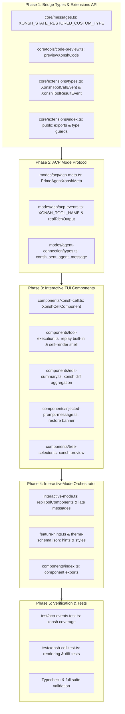

# Migration and Parity Plan: Replacing IPython with Xonsh in UI, Modes, and Extensions

This document establishes the comprehensive engineering plan for replacing `ipython` with `xonsh` (and achieving complete feature parity) across **Extensions API & Types** and **Modes & Interactive UI**.

---

## 1. Executive Summary & Strategy

The repository is transitioning its core persistent REPL runtime from IPython to Xonsh (`packages/coding-agent/src/core/tools/xonsh.ts`). In previous phases, the `xonsh` tool definition and `XonshKernelProvisioner` were implemented and registered. 

To achieve full parity in the user-facing and extension-facing surfaces, all layers that previously had hardcoded awareness of `ipython` must be updated to treat `xonsh` as a primary REPL:
1. **Extensions API & Types (`packages/coding-agent/src/core/extensions/`)**: Extensions intercept tool calls and inspection events. They require typed event definitions (`XonshToolCallEvent`, `XonshToolResultEvent`) and type guards (`isXonshToolResult`, `isToolCallEventType("xonsh", event)`).
2. **ACP Protocol & Events (`packages/coding-agent/src/modes/acp/`)**: Agent Client Protocol (ACP) translates tool calls into IDE/client updates. Xonsh cell executions must map to `"execute"` tool updates titled `"Xonsh cell"` (or configurable), extract source code from `{ code: string }`, and carry rich output metadata (`PrimeAgentXonshMeta`) for image attachments and diff counts.
3. **Agent Connection Events (`packages/coding-agent/src/modes/agent-connection/`)**: The session event union must support agent messages sent from the Xonsh kernel (`xonsh_sent_agent_message`).
4. **Interactive TUI & Components (`packages/coding-agent/src/modes/interactive/`)**: The rich cell component (`IPythonCellComponent` -> `XonshCellComponent` / `ReplCellComponent`), replay definition loader, self-rendering shell, edit diff summarizer, state restoration banner, tree selector, and orchestrator listeners must natively support `xonsh`.

### Migration Strategy: Dual-Support with Aliased Parity
To guarantee zero regressions during the replacement:
- **Component & Types Generalization**: Internal implementations will support both `xonsh` and `ipython` during the transition, with `xonsh` as the primary built-in.
- **Export Aliasing**: Deprecated IPython identifiers (e.g. `IPythonCellComponent`, `isIpythonToolResult`) will be maintained as aliases pointing to their Xonsh equivalents to avoid breaking external extensions or existing tests prematurely.

---

## 2. Scope & File Inventory

From `.planning/2026-09-13-xonsh-integration/ipython-grep-results.md`, the scope comprises 16 files across the two target areas plus 3 tightly coupled bridge files:

### Category 1: Extensions API & Types (2 files, 16 matches)
- [`packages/coding-agent/src/core/extensions/types.ts`](file:///home/jeff/code/fork/prime-agent/packages/coding-agent/src/core/extensions/types.ts) (13 matches)
- [`packages/coding-agent/src/core/extensions/index.ts`](file:///home/jeff/code/fork/prime-agent/packages/coding-agent/src/core/extensions/index.ts) (3 matches)

### Category 2: Modes & Interactive UI (14 files, 100 matches)
- [`packages/coding-agent/src/modes/acp/acp-meta.ts`](file:///home/jeff/code/fork/prime-agent/packages/coding-agent/src/modes/acp/acp-meta.ts) (5 matches)
- [`packages/coding-agent/src/modes/acp/acp-events.ts`](file:///home/jeff/code/fork/prime-agent/packages/coding-agent/src/modes/acp/acp-events.ts) (12 matches)
- [`packages/coding-agent/src/modes/agent-connection/types.ts`](file:///home/jeff/code/fork/prime-agent/packages/coding-agent/src/modes/agent-connection/types.ts) (1 match)
- [`packages/coding-agent/src/modes/interactive/components/ipython-cell.ts`](file:///home/jeff/code/fork/prime-agent/packages/coding-agent/src/modes/interactive/components/ipython-cell.ts) (31 matches)
- [`packages/coding-agent/src/modes/interactive/components/tool-execution.ts`](file:///home/jeff/code/fork/prime-agent/packages/coding-agent/src/modes/interactive/components/tool-execution.ts) (13 matches)
- [`packages/coding-agent/src/modes/interactive/components/conversation-components.ts`](file:///home/jeff/code/fork/prime-agent/packages/coding-agent/src/modes/interactive/components/conversation-components.ts) (2 matches)
- [`packages/coding-agent/src/modes/interactive/components/edit-summary.ts`](file:///home/jeff/code/fork/prime-agent/packages/coding-agent/src/modes/interactive/components/edit-summary.ts) (3 matches)
- [`packages/coding-agent/src/modes/interactive/components/injected-prompt-message.ts`](file:///home/jeff/code/fork/prime-agent/packages/coding-agent/src/modes/interactive/components/injected-prompt-message.ts) (7 matches)
- [`packages/coding-agent/src/modes/interactive/components/tree-selector.ts`](file:///home/jeff/code/fork/prime-agent/packages/coding-agent/src/modes/interactive/components/tree-selector.ts) (2 matches)
- [`packages/coding-agent/src/modes/interactive/components/tool-panel.ts`](file:///home/jeff/code/fork/prime-agent/packages/coding-agent/src/modes/interactive/components/tool-panel.ts) (1 match)
- [`packages/coding-agent/src/modes/interactive/components/index.ts`](file:///home/jeff/code/fork/prime-agent/packages/coding-agent/src/modes/interactive/components/index.ts) (5 matches)
- [`packages/coding-agent/src/modes/interactive/interactive-mode.ts`](file:///home/jeff/code/fork/prime-agent/packages/coding-agent/src/modes/interactive/interactive-mode.ts) (16 matches)
- [`packages/coding-agent/src/modes/interactive/feature-hints.ts`](file:///home/jeff/code/fork/prime-agent/packages/coding-agent/src/modes/interactive/feature-hints.ts) (1 match)
- [`packages/coding-agent/src/modes/interactive/theme/theme-schema.json`](file:///home/jeff/code/fork/prime-agent/packages/coding-agent/src/modes/interactive/theme/theme-schema.json) (1 match)

### Category 3: Directly Coupled Bridge Dependencies (3 files)
- [`packages/coding-agent/src/core/messages.ts`](file:///home/jeff/code/fork/prime-agent/packages/coding-agent/src/core/messages.ts) (Restored state custom message types)
- [`packages/coding-agent/src/core/tools/code-preview.ts`](file:///home/jeff/code/fork/prime-agent/packages/coding-agent/src/core/tools/code-preview.ts) (Code preview generator for cells)
- [`packages/coding-agent/src/modes/interactive/theme/theme.ts`](file:///home/jeff/code/fork/prime-agent/packages/coding-agent/src/modes/interactive/theme/theme.ts) (Syntax highlighting file extension mapping)

---

## 3. Extensions API & Types

### 3.1 [`packages/coding-agent/src/core/extensions/types.ts`](file:///home/jeff/code/fork/prime-agent/packages/coding-agent/src/core/extensions/types.ts)

#### Code Parts to Read:
- **Lines 65–72**: Tool input and details imports from `../tools/index.js` (`BashToolDetails`, `BashToolInput`, `EditToolInput`, `IpythonToolDetails`, `IpythonToolInput`).
- **Lines 772–798**: `ToolCallEvent` hierarchy:
  - `BashToolCallEvent`, `EditToolCallEvent`, `IpythonToolCallEvent`, `CustomToolCallEvent`.
  - Discriminator: `toolName: "ipython"`, `input: IpythonToolInput`.
- **Lines 800–834**: `ToolResultEvent` hierarchy:
  - `BashToolResultEvent`, `EditToolResultEvent`, `IpythonToolResultEvent`, `CustomToolResultEvent`.
  - Discriminator: `toolName: "ipython"`, `details: IpythonToolDetails | undefined`.
- **Lines 835–844**: Result type guards (`isBashToolResult`, `isEditToolResult`, `isIpythonToolResult`).
- **Lines 865–875**: `isToolCallEventType` function overloads for narrowing `ToolCallEvent` by literal tool name.

#### Code Parts to Modify:
1. **Import Xonsh Tool Types**:
   Import `XonshToolDetails` and `XonshToolInput` from `../tools/index.js` (alongside or replacing `IpythonToolDetails`, `IpythonToolInput`).
2. **Define `XonshToolCallEvent`**:
   ```typescript
   export interface XonshToolCallEvent extends ToolCallEventBase {
       toolName: "xonsh";
       input: XonshToolInput;
   }
   ```
3. **Update `ToolCallEvent` Union**:
   ```typescript
   export type ToolCallEvent =
       | BashToolCallEvent
       | EditToolCallEvent
       | XonshToolCallEvent
       | IpythonToolCallEvent
       | CustomToolCallEvent;
   ```
4. **Define `XonshToolResultEvent`**:
   ```typescript
   export interface XonshToolResultEvent extends ToolResultEventBase {
       toolName: "xonsh";
       details: XonshToolDetails | undefined;
   }
   ```
5. **Update `ToolResultEvent` Union**:
   ```typescript
   export type ToolResultEvent =
       | BashToolResultEvent
       | EditToolResultEvent
       | XonshToolResultEvent
       | IpythonToolResultEvent
       | CustomToolResultEvent;
   ```
6. **Implement `isXonshToolResult` Type Guard**:
   ```typescript
   export function isXonshToolResult(e: ToolResultEvent): e is XonshToolResultEvent {
       return e.toolName === "xonsh";
   }
   ```
7. **Add `isToolCallEventType` Overload**:
   ```typescript
   export function isToolCallEventType(toolName: "xonsh", event: ToolCallEvent): event is XonshToolCallEvent;
   ```

---

### 3.2 [`packages/coding-agent/src/core/extensions/index.ts`](file:///home/jeff/code/fork/prime-agent/packages/coding-agent/src/core/extensions/index.ts)

#### Code Parts to Read:
- **Lines 78–79**: Export of `IpythonToolCallEvent`, `IpythonToolResultEvent`.
- **Lines 143–146**: Export of `isIpythonToolResult`.

#### Code Parts to Modify:
1. **Export New Types**:
   Export `XonshToolCallEvent` and `XonshToolResultEvent` from `./types.js`.
2. **Export Type Guard**:
   Export `isXonshToolResult` from `./types.js`.
3. **Maintain Aliases / Deprecations**:
   Retain exports of `IpythonToolCallEvent`, `IpythonToolResultEvent`, and `isIpythonToolResult` marked `@deprecated` or aliased for backwards compatibility during migration.

---

## 4. Modes: Agent Client Protocol (ACP)

ACP enables IDEs (like Zed, JetBrains, VS Code) to interact with Prime Agent over JSON-RPC. It requires accurate mapping of REPL tool calls, cell titles, input arguments, and rich output metadata.

### 4.1 [`packages/coding-agent/src/modes/acp/acp-meta.ts`](file:///home/jeff/code/fork/prime-agent/packages/coding-agent/src/modes/acp/acp-meta.ts)

#### Code Parts to Read:
- **Lines 35–46**: Metadata structures:
  - `PrimeAgentIpythonAttachmentMeta`: `{ mimeType?: string; path?: string; bytes?: number }`.
  - `PrimeAgentIpythonMeta`: `{ attachments?: PrimeAgentIpythonAttachmentMeta[]; diffCount?: number }`.
- **Lines 96–128**: `PrimeAgentSessionMeta` interface, specifically line 126:
  `ipython?: PrimeAgentIpythonMeta;`.

#### Code Parts to Modify:
1. **Define Xonsh Attachment and Metadata Interfaces**:
   ```typescript
   export interface PrimeAgentXonshAttachmentMeta {
       mimeType?: string;
       path?: string;
       bytes?: number;
   }

   export interface PrimeAgentXonshMeta {
       /** Media the cell loaded into context, as reported by the xonsh tool. */
       attachments?: PrimeAgentXonshAttachmentMeta[];
       /** Number of diffs the cell displayed. */
       diffCount?: number;
   }

   // Maintain backward compatibility aliases
   export type PrimeAgentIpythonAttachmentMeta = PrimeAgentXonshAttachmentMeta;
   export type PrimeAgentIpythonMeta = PrimeAgentXonshMeta;
   ```
2. **Update `PrimeAgentSessionMeta`**:
   ```typescript
   export interface PrimeAgentSessionMeta {
       // ... existing fields ...
       xonsh?: PrimeAgentXonshMeta;
       /** @deprecated Use xonsh instead */
       ipython?: PrimeAgentIpythonMeta;
   }
   ```

---

### 4.2 [`packages/coding-agent/src/modes/acp/acp-events.ts`](file:///home/jeff/code/fork/prime-agent/packages/coding-agent/src/modes/acp/acp-events.ts)

#### Code Parts to Read:
- **Lines 22–24**: `export const IPYTHON_TOOL_NAME = "ipython";`
- **Lines 25–38**: `acpToolKind(toolName: string): AcpToolKind` mapping `IPYTHON_TOOL_NAME` and `"bash"` to `"execute"`.
- **Lines 67–72**: `ipythonCellSource(args: unknown): string | undefined` extracting `args.code`.
- **Lines 93–122**: `ipythonRichOutput(result: unknown): PrimeAgentIpythonMeta | undefined` parsing `details.attachments` and `details.diffs`.
- **Lines 158–170**: `case "tool_execution_start"`:
  ```typescript
  const cell = event.toolName === IPYTHON_TOOL_NAME ? ipythonCellSource(event.args) : undefined;
  // title: event.toolName === IPYTHON_TOOL_NAME ? "Python cell" : event.toolName
  ```
- **Lines 172–184**: `case "tool_execution_end"`:
  ```typescript
  const rich = event.toolName === IPYTHON_TOOL_NAME ? ipythonRichOutput(event.result) : undefined;
  // ...(rich ? { _meta: primeAgentMeta({ ipython: rich }) } : {})
  ```
- **Lines 298–310**: `case "ipython_sent_agent_message"` translating kernel-sent agent messages to `session_info_update`.

#### Code Parts to Modify:
1. **Constants**:
   ```typescript
   export const XONSH_TOOL_NAME = "xonsh";
   export const IPYTHON_TOOL_NAME = "ipython"; // Retain for legacy/alias
   ```
2. **Tool Kind Classification**:
   In `acpToolKind(toolName: string)`:
   ```typescript
   switch (toolName) {
       case XONSH_TOOL_NAME:
       case IPYTHON_TOOL_NAME:
       case "bash":
           return "execute";
       // ...
   }
   ```
3. **Cell Source Extraction**:
   Rename or generalize `ipythonCellSource` to `replCellSource(args: unknown): string | undefined`. Since both `ipython` and `xonsh` schemas use `{ code: string }`, the same extraction logic applies.
4. **Rich Output Extraction**:
   Generalize `ipythonRichOutput` to `replRichOutput(result: unknown): PrimeAgentXonshMeta | undefined`. Both `IpythonToolDetails` and `XonshToolDetails` expose `attachments` and `diffs`.
5. **Tool Execution Start Mapping**:
   ```typescript
   case "tool_execution_start": {
       const isRepl = event.toolName === XONSH_TOOL_NAME || event.toolName === IPYTHON_TOOL_NAME;
       const cell = isRepl ? replCellSource(event.args) : undefined;
       const title = event.toolName === XONSH_TOOL_NAME
           ? "Xonsh cell"
           : event.toolName === IPYTHON_TOOL_NAME
               ? "Python cell"
               : event.toolName;
       return [
           {
               sessionUpdate: "tool_call",
               toolCallId: event.toolCallId,
               title,
               kind: acpToolKind(event.toolName),
               status: "in_progress" satisfies AcpToolStatus,
               rawInput: cell !== undefined ? { code: cell } : event.args,
           },
       ];
   }
   ```
6. **Tool Execution End Mapping**:
   In `case "tool_execution_end"`:
   Check `isRepl = event.toolName === XONSH_TOOL_NAME || event.toolName === IPYTHON_TOOL_NAME`.
   Populate `_meta` with `{ xonsh: rich, ipython: rich }` (or `xonsh: rich` when `toolName === XONSH_TOOL_NAME`).
7. **Sent Agent Message Event Handling**:
   Support both `xonsh_sent_agent_message` and `ipython_sent_agent_message`:
   ```typescript
   case "xonsh_sent_agent_message":
   case "ipython_sent_agent_message":
       return [
           {
               sessionUpdate: "session_info_update",
               _meta: primeAgentMeta({
                   agentMessage: {
                       toolCallId: event.toolCallId,
                       target: event.message.target.sessionName ?? event.message.target.sessionId,
                       deliveryStatus: event.message.deliveryStatus,
                   },
               }),
           },
       ];
   ```

---

### 4.3 [`packages/coding-agent/src/modes/agent-connection/types.ts`](file:///home/jeff/code/fork/prime-agent/packages/coding-agent/src/modes/agent-connection/types.ts)

#### Code Parts to Read:
- **Lines 573–576**: `AgentConnectionSessionEvent` definition:
  ```typescript
  export type AgentConnectionSessionEvent =
      | AgentEvent
      | { type: "ipython_sent_agent_message"; toolCallId: string; message: KernelSentAgentMessage }
      | ...
  ```

#### Code Parts to Modify:
1. **Extend or Replace Event Union**:
   ```typescript
   export type AgentConnectionSessionEvent =
       | AgentEvent
       | { type: "xonsh_sent_agent_message"; toolCallId: string; message: KernelSentAgentMessage }
       | { type: "ipython_sent_agent_message"; toolCallId: string; message: KernelSentAgentMessage }
       | ...
   ```
   This allows both in-process and daemon connection layers to stream late agent messages generated by `xonsh` execution.

---

## 5. Modes: Interactive Terminal UI (TUI)

The Interactive TUI provides custom rendering for REPL cells, state restore notices, keybinding-driven expand/collapse, live execution pulses, and edit diff integration.

### 5.1 [`packages/coding-agent/src/modes/interactive/components/ipython-cell.ts`](file:///home/jeff/code/fork/prime-agent/packages/coding-agent/src/modes/interactive/components/ipython-cell.ts) (and Renaming/Aliasing Plan)

#### Code Parts to Read:
- **Lines 8–19**: Imports: `previewIpythonCode`, `parseIpythonBashCell`, `highlightCode`, `theme`, error normalizers, diff renderers.
- **Lines 20–30**:
  - `IPythonCellContentBlock`: `{ type: string; text?: string; data?: string; mimeType?: string }`.
  - `IPythonCellState`: `{ code: string; content?: readonly ...; details?: unknown; expanded?: boolean; ... }`.
- **Lines 63–80**: `IpythonDetails` and `IpythonErrorDetails` structures:
  - `durationMs`, `status`, `errorEname`, `stdout`, `stderr`, `result`, `backgroundOutput`, `diffs`, `sentAgentMessages`, `error`.
- **Lines 130–136**: `getIpythonCodeFromArgs(args: unknown): string`.
- **Lines 138–160**: `readDetails(details: unknown): IpythonDetails`.
- **Lines 324–334**: `formatIpythonErrorSummary(error: IpythonErrorDetails): string`.
- **Lines 336–390**: `IPythonCellComponent` class:
  - State versioning with `VersionedRenderCache`.
  - Live pulse animation keying (`WORKING_ICON_FRAMES`, `getWorkingPulseFrame()`).
- **Lines 391–423**: `collapsedLine(details: IpythonDetails): string`:
  - Determines language label (`bash`, `python`, `xonsh`).
  - Calls `previewIpythonCode`.
  - Formats line counts, duration, error name, expand hint (`expandCollapseHint("app.tools.expand", ...)`).
- **Lines 443–465**: `lineCounts(details: IpythonDetails)` calculating input lines vs output lines.
- **Lines 500–533**: `renderCode` and `highlightInputLine`:
  - Distinguishes bash magic / subshell commands vs Python syntax highlighting.
- **Lines 535–635**: `renderOutput`:
  - Renders stdout, stderr, expression result, unattributed background output, rich diffs, sent agent messages, and formatted tracebacks.

#### Code Parts to Modify:
1. **File Strategy**:
   - Refactor `ipython-cell.ts` into a unified `xonsh-cell.ts` (or `repl-cell.ts`).
   - Export both `XonshCellComponent` and alias `IPythonCellComponent = XonshCellComponent`.
   - Re-export all types with `Xonsh*` names, retaining `IPython*` as type aliases.
2. **State & Argument Extraction**:
   - Add `getXonshCodeFromArgs(args: unknown): string`:
     ```typescript
     export function getXonshCodeFromArgs(args: unknown): string {
         if (!args || typeof args !== "object" || !("code" in args)) return "";
         const code = (args as { code?: unknown }).code;
         return typeof code === "string" ? code : "";
     }
     export const getIpythonCodeFromArgs = getXonshCodeFromArgs;
     ```
3. **Preview & Language Classification**:
   - Update `collapsedLine` to use `previewXonshCode` (see Section 6).
   - In Xonsh, statements can be Python expressions, shell commands, or hybrid subprocess expressions (e.g. `$(cmd)`, `![cmd]`, `@(expr)`).
   - The language badge should show `"xonsh"` or `"xonsh · bash"` when executing pure shell commands.
4. **Syntax Highlighting in `renderCode`**:
   - Highlight with `"python"` (or `"xonsh"` once registered in Prism/highlight engine). Since Xonsh is a superset of Python 3, Python highlighting provides excellent base tokenization for keywords, strings, numbers, and functions.
   - For lines starting with subprocess operators (`$`, `!`, `@`), apply theme shell styling (`theme.fg("bashMode", rawLine)`).
5. **Traceback & Error Handling**:
   - Adapt `formatIpythonErrorSummary` to `formatXonshErrorSummary` (handling Python standard tracebacks and Xonsh syntax/runtime errors seamlessly).

---

### 5.2 [`packages/coding-agent/src/modes/interactive/components/tool-execution.ts`](file:///home/jeff/code/fork/prime-agent/packages/coding-agent/src/modes/interactive/components/tool-execution.ts)

#### Code Parts to Read:
- **Line 12**: Import of `getIpythonCodeFromArgs, IPythonCellComponent`.
- **Lines 47–67**: `createReplayBuiltInToolDefinition(toolName, cwd, toolDefinition)`:
  ```typescript
  if (toolName === "ipython") {
      return createAllToolDefinitions(cwd).ipython;
  }
  ```
- **Line 74**: Component member `private ipythonCellComponent?: IPythonCellComponent;`.
- **Lines 161–176**: `getRenderShell()` and `shouldUseIpythonRenderer()`:
  ```typescript
  private shouldUseIpythonRenderer(): boolean {
      return this.toolName === "ipython" && !this.toolDefinition?.renderCall && !this.toolDefinition?.renderResult;
  }
  ```
- **Lines 350–375**: `updateDisplay()` self-rendered shell branch:
  Instantiating and updating `this.ipythonCellComponent` with state from `getIpythonCodeFromArgs(this.args)`.

#### Code Parts to Modify:
1. **Replay Tool Definition**:
   In `createReplayBuiltInToolDefinition`:
   ```typescript
   if (toolName === "xonsh") {
       return createAllToolDefinitions(cwd).xonsh;
   }
   if (toolName === "ipython") {
       return createAllToolDefinitions(cwd).ipython;
   }
   ```
2. **Renderer Selection**:
   Rename/generalize `shouldUseIpythonRenderer` to `shouldUseReplRenderer`:
   ```typescript
   private shouldUseReplRenderer(): boolean {
       return (this.toolName === "xonsh" || this.toolName === "ipython") &&
              !this.toolDefinition?.renderCall &&
              !this.toolDefinition?.renderResult;
   }
   ```
3. **Component Instantiation**:
   - Rename `ipythonCellComponent` to `replCellComponent?: XonshCellComponent;`.
   - In `updateDisplay()`:
     Extract code via `getXonshCodeFromArgs(this.args)`.
     Instantiate or update `this.replCellComponent`.
     Add to `this.selfRenderContainer`.

---

### 5.3 [`packages/coding-agent/src/modes/interactive/components/conversation-components.ts`](file:///home/jeff/code/fork/prime-agent/packages/coding-agent/src/modes/interactive/components/conversation-components.ts)

#### Code Parts to Read:
- **Line 22**: `import { IPythonCellComponent } from "./ipython-cell.js";`
- **Lines 51–58**: `isCompactAgentMessageNeighbor(component: Component | undefined): boolean`:
  ```typescript
  export function isCompactAgentMessageNeighbor(component: Component | undefined): boolean {
      return (
          component instanceof AgentMessageComponent ||
          component instanceof ToolExecutionComponent ||
          component instanceof IPythonCellComponent ||
          component instanceof BashExecutionComponent
      );
  }
  ```

#### Code Parts to Modify:
1. **Update Import**:
   Import `XonshCellComponent` (or updated `IPythonCellComponent` alias).
2. **Update Neighbor Typecheck**:
   Ensure `component instanceof XonshCellComponent` returns `true` so consecutive agent messages and tool executions preserve tight vertical spacing without redundant blank padding lines.

---

### 5.4 [`packages/coding-agent/src/modes/interactive/components/edit-summary.ts`](file:///home/jeff/code/fork/prime-agent/packages/coding-agent/src/modes/interactive/components/edit-summary.ts)

#### Code Parts to Read:
- **Line 7**: `import type { IpythonToolDetails } from "../../../core/tools/ipython.js";`
- **Lines 41–53**: `getToolFileChanges(toolName, args, result, cwd)`:
  ```typescript
  if (toolName === "ipython") {
      for (const display of (result.details as IpythonToolDetails | undefined)?.diffs ?? []) {
          const { diff } = generateDiffString(display.oldStr, display.newStr, 4, display.startLine ?? 1);
          mergeFileChange(changes, { path: display.path, ...countChangedLines(diff) }, cwd);
      }
  }
  ```

#### Code Parts to Modify:
1. **Import `XonshToolDetails`**:
   Import `XonshToolDetails` from `../../../core/tools/xonsh.js`.
2. **Recognize `xonsh` Tool Diffs**:
   ```typescript
   if (toolName === "xonsh" || toolName === "ipython") {
       const diffs = (result.details as (XonshToolDetails | IpythonToolDetails) | undefined)?.diffs ?? [];
       for (const display of diffs) {
           const { diff } = generateDiffString(display.oldStr, display.newStr, 4, display.startLine ?? 1);
           mergeFileChange(changes, { path: display.path, ...countChangedLines(diff) }, cwd);
       }
   }
   ```
   This ensures file change summaries in the footer and turn statistics correctly aggregate diffs emitted by programmatic file operations inside Xonsh.

---

### 5.5 [`packages/coding-agent/src/modes/interactive/components/injected-prompt-message.ts`](file:///home/jeff/code/fork/prime-agent/packages/coding-agent/src/modes/interactive/components/injected-prompt-message.ts)

#### Code Parts to Read:
- **Lines 19–20**: `IPYTHON_STATE_RESTORED_CUSTOM_TYPE`, `type IpythonStateRestoredDetails`.
- **Lines 30–37**: `InjectedPromptDetails` union.
- **Lines 39–49**: `isInjectedPromptMessage` guard.
- **Lines 120–127**: `this.message.customType !== IPYTHON_STATE_RESTORED_CUSTOM_TYPE` expansion guard.
- **Lines 143–147**:
  ```typescript
  if (this.message.customType === IPYTHON_STATE_RESTORED_CUSTOM_TYPE) {
      const details = this.message.details as IpythonStateRestoredDetails | undefined;
      const label = details?.restored === false ? "Started fresh Python kernel" : "Restored Python kernel state";
      return `${theme.fg("accent", "◆")} ${theme.fg("muted", label)}`;
  }
  ```

#### Code Parts to Modify:
1. **Bridge Message Import**:
   Import `XONSH_STATE_RESTORED_CUSTOM_TYPE` and `XonshStateRestoredDetails` from `../../../core/messages.js`.
2. **Injected Prompt Union & Guard**:
   Add `XonshStateRestoredDetails` to `InjectedPromptDetails` and check `message.customType === XONSH_STATE_RESTORED_CUSTOM_TYPE`.
3. **Banner Formatting**:
   ```typescript
   if (
       this.message.customType === XONSH_STATE_RESTORED_CUSTOM_TYPE ||
       this.message.customType === IPYTHON_STATE_RESTORED_CUSTOM_TYPE
   ) {
       const details = this.message.details as (XonshStateRestoredDetails | IpythonStateRestoredDetails) | undefined;
       const isXonsh = this.message.customType === XONSH_STATE_RESTORED_CUSTOM_TYPE;
       const kernelName = isXonsh ? "Xonsh" : "Python";
       const label = details?.restored === false
           ? `Started fresh ${kernelName} kernel`
           : `Restored ${kernelName} kernel state`;
       return `${theme.fg("accent", "◆")} ${theme.fg("muted", label)}`;
   }
   ```

---

### 5.6 [`packages/coding-agent/src/modes/interactive/components/tree-selector.ts`](file:///home/jeff/code/fork/prime-agent/packages/coding-agent/src/modes/interactive/components/tree-selector.ts)

#### Code Parts to Read:
- **Lines 879–886**: Node label formatting in session tree:
  ```typescript
  case "ipython": {
      const rawCode = String(args.code || "");
      const code = rawCode
          .replace(/[\n\t]/g, " ")
          .trim()
          .slice(0, 50);
      return `[ipython: ${code}${rawCode.length > 50 ? "..." : ""}]`;
  }
  ```

#### Code Parts to Modify:
1. **Add `case "xonsh":`**:
   ```typescript
   case "xonsh": {
       const rawCode = String(args.code || "");
       const code = rawCode
           .replace(/[\n\t]/g, " ")
           .trim()
           .slice(0, 50);
       return `[xonsh: ${code}${rawCode.length > 50 ? "..." : ""}]`;
   }
   ```

---

### 5.7 [`packages/coding-agent/src/modes/interactive/components/tool-panel.ts`](file:///home/jeff/code/fork/prime-agent/packages/coding-agent/src/modes/interactive/components/tool-panel.ts)

#### Code Parts to Read:
- **Lines 23–29**: Class documentation referencing IPython cell line wrapping behavior.

#### Code Parts to Modify:
1. **Update Doc Comment**:
   Update reference from `"matching ipython cell behavior"` to `"matching xonsh / REPL cell behavior"`.

---

### 5.8 [`packages/coding-agent/src/modes/interactive/components/index.ts`](file:///home/jeff/code/fork/prime-agent/packages/coding-agent/src/modes/interactive/components/index.ts)

#### Code Parts to Read:
- **Lines 28–33**: Export block for IPython cell components:
  ```typescript
  export {
      getIpythonCodeFromArgs,
      IPythonCellComponent,
      type IPythonCellContentBlock,
      type IPythonCellState,
  } from "./ipython-cell.js";
  ```

#### Code Parts to Modify:
1. **Export Xonsh Cell Types and Component**:
   ```typescript
   export {
       getXonshCodeFromArgs,
       getIpythonCodeFromArgs,
       XonshCellComponent,
       IPythonCellComponent,
       type XonshCellContentBlock,
       type IPythonCellContentBlock,
       type XonshCellState,
       type IPythonCellState,
   } from "./xonsh-cell.js";
   ```

---

### 5.9 [`packages/coding-agent/src/modes/interactive/interactive-mode.ts`](file:///home/jeff/code/fork/prime-agent/packages/coding-agent/src/modes/interactive/interactive-mode.ts)

#### Code Parts to Read:
- **Lines 1024–1027**: Tool registration maps:
  ```typescript
  private pendingTools = new Map<string, ToolExecutionComponent>();
  private ipythonToolComponents = new Map<string, ToolExecutionComponent>();
  private lateIpythonSentAgentMessages = new Map<string, KernelSentAgentMessage[]>();
  ```
- **Lines 2936–2937**: Resetting state on session change:
  ```typescript
  this.ipythonToolComponents.clear();
  this.lateIpythonSentAgentMessages.clear();
  ```
- **Lines 3032–3040**: `registerIpythonToolComponent`:
  ```typescript
  private registerIpythonToolComponent(toolName: string, toolCallId: string, component: ToolExecutionComponent): void {
      if (toolName !== "ipython") {
          return;
      }
      this.ipythonToolComponents.set(toolCallId, component);
      for (const lateMessage of this.lateIpythonSentAgentMessages.get(toolCallId) ?? []) {
          component.appendSentAgentMessage(lateMessage);
      }
  }
  ```
- **Line 3089**: Registering in `getOrCreatePendingToolComponent`:
  `this.registerIpythonToolComponent(latestToolCall.name, latestToolCall.id, component);`
- **Lines 5674–5684**: Event listener for late agent messages:
  ```typescript
  case "ipython_sent_agent_message": {
      const messages = this.lateIpythonSentAgentMessages.get(event.toolCallId) ?? [];
      if (!messages.some((message) => message.id === event.message.id)) {
          messages.push(event.message);
          this.lateIpythonSentAgentMessages.set(event.toolCallId, messages);
      }
      this.ipythonToolComponents.get(event.toolCallId)?.appendSentAgentMessage(event.message);
      this.ui.requestRender();
      break;
  }
  ```
- **Lines 6541–6542 & Line 6612**: Resetting and registering during conversation component rebuild.

#### Code Parts to Modify:
1. **Generalize Component & Message Tracking Maps**:
   Rename `ipythonToolComponents` to `replToolComponents` (or `kernelToolComponents`), and `lateIpythonSentAgentMessages` to `lateKernelSentAgentMessages`.
2. **Update `registerReplToolComponent`**:
   Accept both `"xonsh"` and `"ipython"`:
   ```typescript
   private registerReplToolComponent(toolName: string, toolCallId: string, component: ToolExecutionComponent): void {
       if (toolName !== "xonsh" && toolName !== "ipython") {
           return;
       }
       this.replToolComponents.set(toolCallId, component);
       for (const lateMessage of this.lateKernelSentAgentMessages.get(toolCallId) ?? []) {
           component.appendSentAgentMessage(lateMessage);
       }
   }
   ```
3. **Handle Both Message Event Types**:
   In `sessionEventQueue` event dispatch:
   ```typescript
   case "xonsh_sent_agent_message":
   case "ipython_sent_agent_message": {
       const messages = this.lateKernelSentAgentMessages.get(event.toolCallId) ?? [];
       if (!messages.some((message) => message.id === event.message.id)) {
           messages.push(event.message);
           this.lateKernelSentAgentMessages.set(event.toolCallId, messages);
       }
       this.replToolComponents.get(event.toolCallId)?.appendSentAgentMessage(event.message);
       this.ui.requestRender();
       break;
   }
   ```
4. **Lifecycle Clears**:
   Update lines 2936 and 6541 to clear `this.replToolComponents` and `this.lateKernelSentAgentMessages`.

---

### 5.10 [`packages/coding-agent/src/modes/interactive/feature-hints.ts`](file:///home/jeff/code/fork/prime-agent/packages/coding-agent/src/modes/interactive/feature-hints.ts)

#### Code Parts to Read:
- **Lines 77–80**:
  ```typescript
  {
      id: "persistent-ipython",
      getText: () => "Compaction removes kernel variables over 16 MiB; smaller state persists.",
  }
  ```

#### Code Parts to Modify:
1. **Update Hint Identifier**:
   Change `id: "persistent-ipython"` to `id: "persistent-xonsh"` (or `"persistent-kernel"`).

---

### 5.11 [`packages/coding-agent/src/modes/interactive/theme/theme-schema.json`](file:///home/jeff/code/fork/prime-agent/packages/coding-agent/src/modes/interactive/theme/theme-schema.json)

#### Code Parts to Read:
- **Lines 183–186**:
  ```json
  "toolPanelBg": {
      "$ref": "#/$defs/colorValue",
      "description": "Tool panel background (ipython cells and tool executions)"
  }
  ```

#### Code Parts to Modify:
1. **Update Description**:
   Change description to: `"Tool panel background (xonsh cells and tool executions)"`.

---

## 6. Directly Coupled Bridge Dependencies

To ensure UI and Extension changes compile and function seamlessly, three bridge dependencies must be modified in coordination:

### 6.1 [`packages/coding-agent/src/core/messages.ts`](file:///home/jeff/code/fork/prime-agent/packages/coding-agent/src/core/messages.ts)
- **Read Lines 31 & 214**:
  - `IPYTHON_STATE_RESTORED_CUSTOM_TYPE = "ipython_state_restored"`
  - `IpythonStateRestoredDetails: { restored: boolean }`
- **Modify**:
  - Add `XONSH_STATE_RESTORED_CUSTOM_TYPE = "xonsh_state_restored"`.
  - Add `XonshStateRestoredDetails: { restored: boolean }`.
  - Export aliases so `injected-prompt-message.ts` can render both uniformly.

### 6.2 [`packages/coding-agent/src/core/tools/code-preview.ts`](file:///home/jeff/code/fork/prime-agent/packages/coding-agent/src/core/tools/code-preview.ts)
- **Read Lines 532–540**:
  - `previewIpythonCode(code: string): CodePreview`: unwraps `parseIpythonBashCell` and calls `previewPythonCode`.
- **Modify**:
  - Implement `previewXonshCode(code: string): CodePreview`:
    Detects single-line and multi-line Xonsh commands. If the line begins with shell commands or Xonsh subprocess syntax (`$[]`, `!()`, `@()`), returns language `"bash"` or `"xonsh"`. Otherwise returns `previewPythonCode(trimmedCode)`.
  - Export `previewXonshCode` for use in `xonsh-cell.ts`.

### 6.3 [`packages/coding-agent/src/modes/interactive/theme/theme.ts`](file:///home/jeff/code/fork/prime-agent/packages/coding-agent/src/modes/interactive/theme/theme.ts)
- **Read Lines 1228–1265**:
  - Mapping from file extensions to syntax highlighter languages (`extToLang`).
- **Modify**:
  - Add `xsh: "python"` (or `"xonsh"`) so `.xsh` files viewed or edited in the TUI receive appropriate syntax highlighting.

---

## 7. Parity Matrix: IPython vs. Xonsh

| Capability | IPython Implementation | Xonsh Implementation | Parity Status |
| :--- | :--- | :--- | :---: |
| **Extension Tool Call Event** | `IpythonToolCallEvent` (`toolName: "ipython"`) | `XonshToolCallEvent` (`toolName: "xonsh"`) | Full Parity |
| **Extension Tool Result Event** | `IpythonToolResultEvent` (`IpythonToolDetails`) | `XonshToolResultEvent` (`XonshToolDetails`) | Full Parity |
| **Extension Type Guards** | `isIpythonToolResult`, `isToolCallEventType("ipython", ...)` | `isXonshToolResult`, `isToolCallEventType("xonsh", ...)` | Full Parity |
| **ACP Tool Kind** | `"execute"` | `"execute"` | Full Parity |
| **ACP Tool Title** | `"Python cell"` | `"Xonsh cell"` | Full Parity |
| **ACP Rich Output Metadata** | `_meta.ipython` (`attachments`, `diffCount`) | `_meta.xonsh` (plus aliased `_meta.ipython`) | Full Parity + Wire Compatible |
| **ACP Sent Agent Message** | `ipython_sent_agent_message` -> `session_info_update` | `xonsh_sent_agent_message` -> `session_info_update` | Full Parity |
| **TUI Cell Component** | `IPythonCellComponent` | `XonshCellComponent` (aliased to `IPythonCellComponent`) | Full Parity |
| **TUI Collapsed Header** | `marker · lang · preview · lines · dur · err` | `marker · lang · preview · lines · dur · err` | Full Parity |
| **TUI Pulse Animation** | `workingIconFrame` on running execution | Identical frame rendering via state version cache | Full Parity |
| **TUI Diff Rendering** | Inline diffs from `details.diffs` | Identical inline diffs from `details.diffs` | Full Parity |
| **TUI Image Attachments** | Terminal image display via kitty/iTerm2/sixel protocols | Identical `Image` block display via `details.attachments` | Full Parity |
| **TUI Sent Agent Messages** | Embedded delivery boxes (`parent`/`child`/`sibling`) | Identical delivery boxes from `details.sentAgentMessages` | Full Parity |
| **TUI State Restored Banner** | `Restored Python kernel state` | `Restored Xonsh kernel state` | Full Parity |
| **TUI Tree Selector** | `[ipython: <code>]` | `[xonsh: <code>]` | Full Parity |
| **Edit Aggregation** | `getToolFileChanges` parses `ipython` diffs | `getToolFileChanges` parses `xonsh` diffs | Full Parity |

---

## 8. Test Suite Impact & Verification Plan

### 8.1 Tests to Update or Mirror
The following existing test suites in `packages/coding-agent/test/` directly verify UI, Modes, or Extensions behavior and must be updated or supplemented with equivalent Xonsh tests:

1. **ACP Event Translation**:
   - `packages/coding-agent/test/acp-events.test.ts`:
     - Test `acpToolKind("xonsh") === "execute"`.
     - Test `tool_execution_start` with `toolName: "xonsh"` generates `title: "Xonsh cell"` and `{ rawInput: { code } }`.
     - Test `tool_execution_end` with `toolName: "xonsh"` attaches `_meta.xonsh` with attachments and diff counts.
     - Test `xonsh_sent_agent_message` produces `session_info_update` with `agentMessage` metadata.
2. **Cell UI & Rendering**:
   - `packages/coding-agent/test/ipython-cell.test.ts` (create `xonsh-cell.test.ts` or extend):
     - Test collapsed preview line with Xonsh and Python code.
     - Test line count formatting.
     - Test syntax highlighting and error traceback formatting.
   - `packages/coding-agent/test/ipython-cell-diff.test.ts`:
     - Test that diffs emitted in `XonshToolDetails` render identically.
   - `packages/coding-agent/test/ipython-cell-background-output.test.ts`:
     - Verify unattributed background output renders below cell.
   - `packages/coding-agent/test/ipython-cell-sent-messages.test.ts`:
     - Verify agent messages sent during cell execution render nested under the cell.
   - `packages/coding-agent/test/ipython-cell-images.test.ts`:
     - Verify image attachments render properly.
3. **Tool Execution Component**:
   - `packages/coding-agent/test/tool-execution.test.ts`:
     - Verify replay definition for `"xonsh"` loads `createAllToolDefinitions(cwd).xonsh`.
     - Verify self-render shell activates for `"xonsh"`.
4. **Edit Summary & State Restoration**:
   - `packages/coding-agent/test/edit-summary.test.ts`:
     - Verify `getToolFileChanges` extracts file diffs from `"xonsh"` results.
   - Interactive status and injected prompt tests:
     - Verify `XONSH_STATE_RESTORED_CUSTOM_TYPE` produces `"Restored Xonsh kernel state"` header.

---

## 9. Phased Execution Roadmap



### Milestone Checklist:
- [ ] **Phase 1: Extensions & Bridge**
  - [ ] Add `XONSH_STATE_RESTORED_CUSTOM_TYPE` to `core/messages.ts`.
  - [ ] Implement `previewXonshCode` in `core/tools/code-preview.ts`.
  - [ ] Add `XonshToolCallEvent`, `XonshToolResultEvent`, `isXonshToolResult` to `core/extensions/types.ts`.
  - [ ] Re-export types from `core/extensions/index.ts`.
- [ ] **Phase 2: ACP Mode Protocol**
  - [ ] Add `PrimeAgentXonshMeta` to `modes/acp/acp-meta.ts`.
  - [ ] Update `acp-events.ts` to support `XONSH_TOOL_NAME`, rich output, and cell source extraction.
  - [ ] Add `xonsh_sent_agent_message` to `agent-connection/types.ts`.
- [ ] **Phase 3: Interactive Components**
  - [ ] Create `xonsh-cell.ts` (with `IPythonCellComponent` backwards-compatible alias).
  - [ ] Update `tool-execution.ts` for `"xonsh"` replay tool definition and self-render shell.
  - [ ] Update `conversation-components.ts`, `edit-summary.ts`, and `injected-prompt-message.ts`.
  - [ ] Update `tree-selector.ts` for `"xonsh"`.
- [ ] **Phase 4: Interactive Mode Orchestrator**
  - [ ] Update `interactive-mode.ts` tool component tracking and message routing.
  - [ ] Update `feature-hints.ts`, `theme-schema.json`, and `theme.ts`.
  - [ ] Re-export updated components in `modes/interactive/components/index.ts`.
- [ ] **Phase 5: Test Verification**
  - [ ] Run and pass ACP event test suite with Xonsh assertions.
  - [ ] Run and pass interactive cell unit tests.
  - [ ] Run `npm run check` (typecheck + linter) across workspace.
